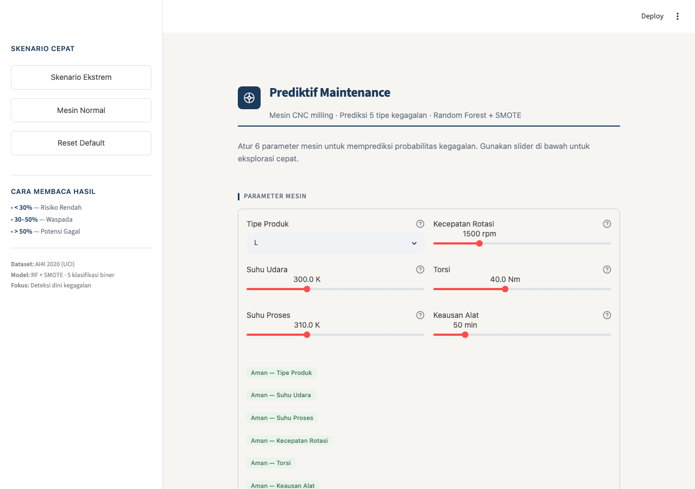

# 🔧 Predictive Maintenance — AI4I 2020 Dataset

**Prediksi 5 tipe kegagalan mesin CNC milling** menggunakan **Random Forest** dengan penanganan **class imbalance ekstrem** (99%+ normal).

## 📂 Struktur Folder

```
├── app/
│   └── streamlit_app.py      # Streamlit UI — form 6 fitur → prediksi 5 failure type
├── data/
│   └── ai4i2020.csv           # Dataset AI4I 2020 (10.000 entri, 14 kolom)
├── models/
│   ├── TWF_rf.pkl             # Pipeline: Scaler→SMOTE→SelectKBest→RF (Tool Wear Failure)
│   ├── HDF_rf.pkl             # (Heat Dissipation Failure)
│   ├── PWF_rf.pkl             # (Power Failure)
│   ├── OSF_rf.pkl             # (Overstrain Failure)
│   ├── RNF_rf.pkl             # (Random Failure)
│   └── type_encoder.pkl       # LabelEncoder untuk kolom Type (L/M/H)
├── notebooks/
│   └── predictive_maintenance_rf_nb_balanced.ipynb   # Notebook eksperimen asli
├── src/
│   ├── preprocess.py          # Load data, encode, feature/target definitions
│   ├── train.py               # Pipeline training per target
│   ├── evaluate.py            # Metrik evaluasi (F1, Recall, ROC-AUC, CM)
│   └── predict.py             # Inference untuk single sample / batch
├── requirements.txt           # Dependensi Python
└── README.md                  # Dokumentasi ini
```

## 🚀 Quick Start

```bash
# 1. Install dependencies
pip install -r requirements.txt

# 2. Train model (unduh dataset + train 5 classifier)
python3 -c "from src.train import train_all; train_all(force_rerun=True)"

# 3. Jalankan Streamlit UI
streamlit run app/streamlit_app.py
```

## 🧠 Model Pipeline

Setiap target klasifikasi biner menggunakan pipeline yang sama:

```
StandardScaler  →  SMOTE  →  SelectKBest  →  RandomForestClassifier
                                                      │
                                          class_weight='balanced'
```

### Strategi Anti-Bias ke Kelas Normal

Dataset memiliki **99.19%–99.81% data Normal** (0) dan hanya **0.19%–1.15% data Failure** (1). Tanpa penanganan, model akan selalu memprediksi "Normal" dan mendapatkan akurasi ~99% — menyesatkan.

**Multi-layer approach:**

| Lapisan | Teknik | Level |
|---------|--------|-------|
| 1 | **SMOTE** | Data — menambah sampel sintetis kelas minoritas |
| 2 | **Stratified split** | Data — menjaga proporsi kelas di train/test |
| 3 | **class_weight='balanced'** | Algoritma — RF memberi bobot lebih pada kelas minoritas |
| 4 | **SelectKBest** | Fitur — memilih fitur paling informatif |
| 5 | **F1-macro, Recall-minority, ROC-AUC** | Evaluasi — metrik yang tidak bias ke kelas mayoritas |

## 📊 Hasil Evaluasi (Test Set)

| Target | Failure Rate | F1-macro | Recall (Minoritas) | ROC-AUC | Keterangan |
|--------|-------------|----------|--------------------|---------|------------|
| TWF | 0.46% | 0.53 | 0.11 | 0.96 | Sulit (sangat jarang) |
| HDF | 1.15% | **0.93** | **0.83** | 0.98 | ✅ Baik |
| PWF | 0.95% | **0.93** | **0.95** | 1.00 | ✅ Sangat baik |
| OSF | 0.98% | 0.79 | 0.45 | 1.00 | Cukup |
| RNF | 0.19% | 0.50 | 0.00 | 0.59 | ⚠️ Sulit (acak, sangat jarang) |

### Interpretasi
- **HDF & PWF** — model sangat baik mendeteksi kegagalan (Recall minoritas > 80%)
- **OSF** — cukup baik, recall minoritas 45%
- **TWF** — recall minoritas rendah (11%), hanya 9 sampel gagal di test set
- **RNF** — hampir tidak terdeteksi. Random Failure bersifat acak dan tidak bergantung kondisi fisik mesin → batasan fundamental dataset

## 🖥️ Streamlit UI



```
streamlit run app/streamlit_app.py
```

Fitur:
- **Form input** 6 parameter mesin: Type, Air Temp, Process Temp, Rotational Speed, Torque, Tool Wear
- **Output**: Probabilitas untuk setiap 5 tipe kegagalan
- **Visualisasi**: Bar chart probabilitas
- **Severity info**: Penjelasan dampak setiap tipe kegagalan

## 📦 Dataset

**AI4I 2020 Predictive Maintenance** (UCI Machine Learning Repository)

- 10.000 entri mesin CNC milling
- 6 fitur: Type (L/M/H), Air temperature, Process temperature, Rotational speed, Torque, Tool wear
- 5 target biner: TWF, HDF, PWF, OSF, RNF
- Sumber: [UCI Repository](https://archive.ics.uci.edu/dataset/601/ai4i2020+predictive+maintenance+dataset)

## 📝 Referensi

Waghulde, Y. et al. (2025). *Evaluating Machine Learning and Deep Learning Models for Predictive Maintenance: A Study Using the AI4I 2020 Dataset*.
